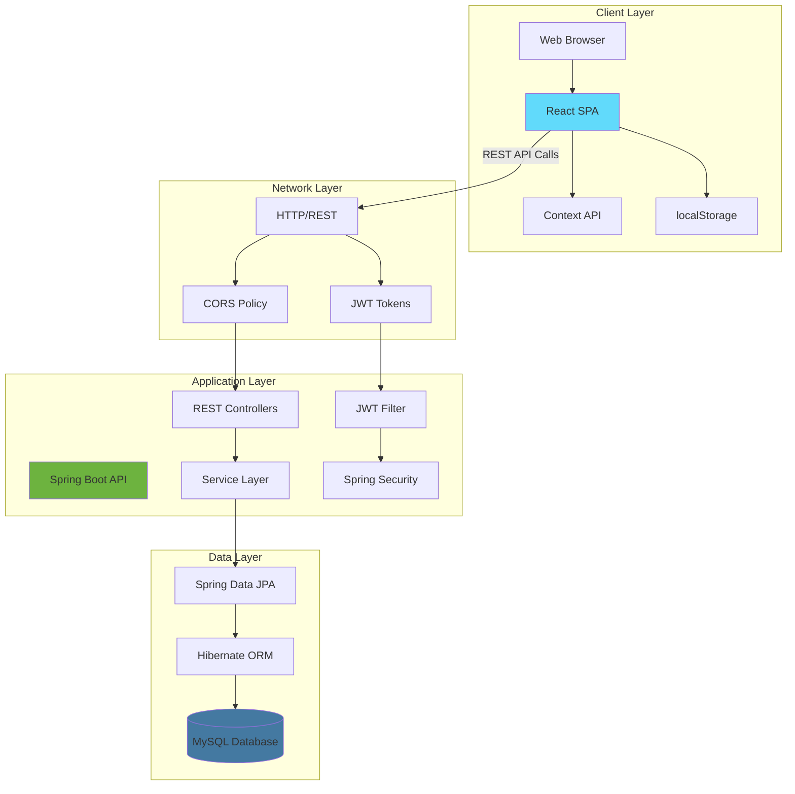
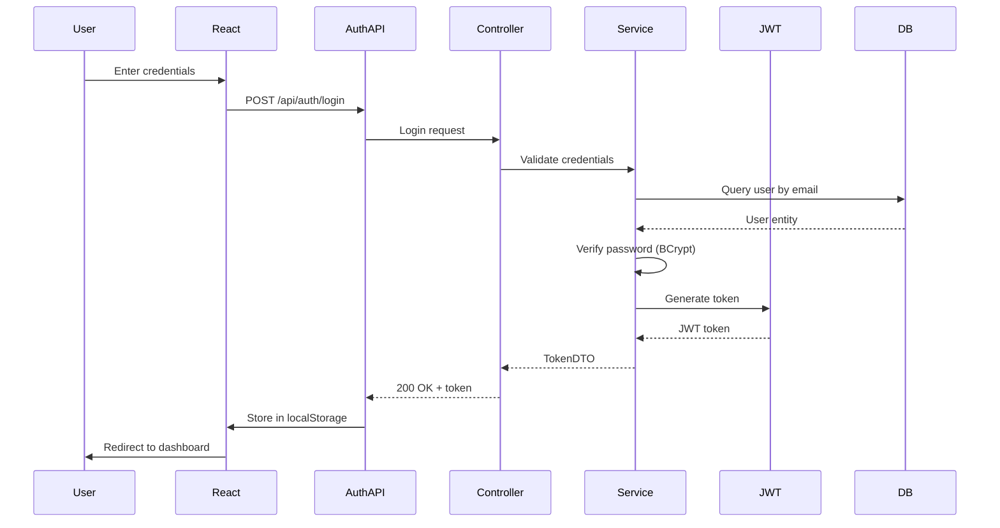
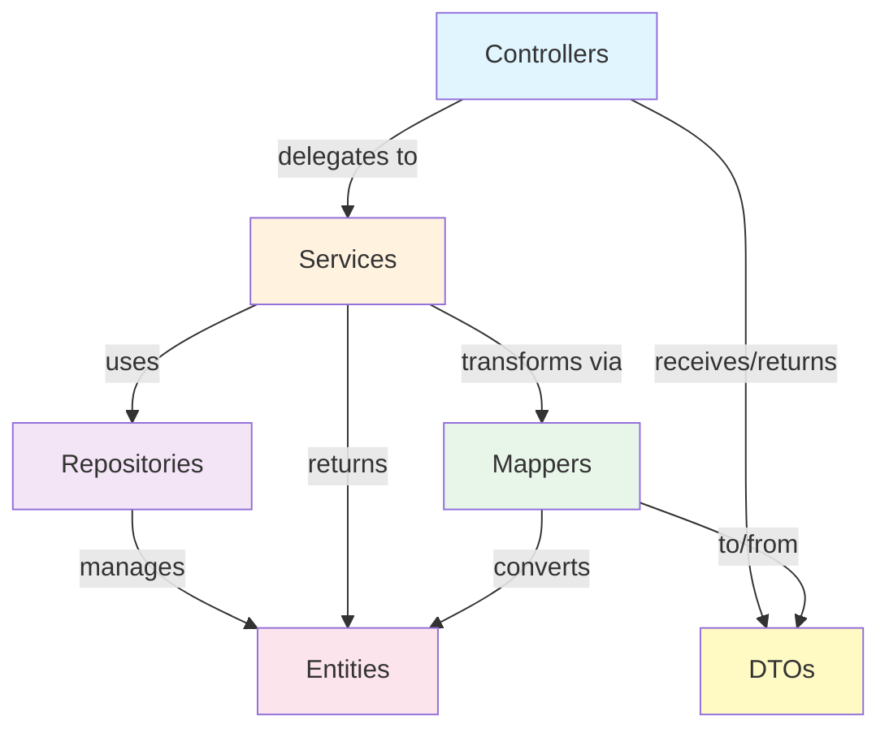
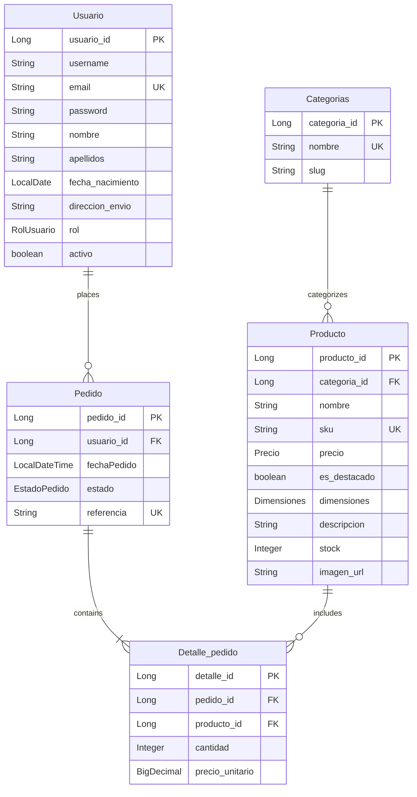

Iquea Commerce follows a modern client-server architecture, separating the presentation layer (React SPA) from the business logic and data access layers (Spring Boot REST API).

## Architecture Overview



## Technology Stack

<Tabs>
  <Tab title="Frontend">
    ### React Single Page Application
    
    The client application is built with modern React and TypeScript:
    
    | Technology | Version | Purpose |
    |------------|---------|----------|
    | **React** | 19.2.0 | UI framework |
    | **TypeScript** | 5.9.3 | Type safety |
    | **Vite** | 7.3.1 | Build tool & dev server |
    | **React Router** | 7.13.0 | Client-side routing |
    | **jwt-decode** | 4.0.0 | JWT token parsing |
    | **React Icons** | 5.5.0 | Icon library |
    
    ### Key Dependencies
    
    ```json package.json
    {
      "dependencies": {
        "jwt-decode": "^4.0.0",
        "react": "^19.2.0",
        "react-dom": "^19.2.0",
        "react-icons": "^5.5.0",
        "react-router-dom": "^7.13.0"
      },
      "devDependencies": {
        "@types/react": "^19.2.5",
        "@types/react-dom": "^19.2.3",
        "@vitejs/plugin-react": "^5.1.1",
        "typescript": "~5.9.3",
        "vite": "^7.3.1"
      }
    }
    ```
  </Tab>
  
  <Tab title="Backend">
    ### Spring Boot REST API
    
    The server application uses Spring Boot 3.4.0 with Java:
    
    | Technology | Version | Purpose |
    |------------|---------|----------|
    | **Spring Boot** | 3.4.0 | Application framework |
    | **Spring Security** | 3.4.0 | Authentication & authorization |
    | **Spring Data JPA** | 3.4.0 | Data access layer |
    | **Hibernate** | 6.x | ORM implementation |
    | **JJWT** | 0.12.6 | JWT token handling |
    | **MySQL Connector** | Latest | Database driver |
    
    ### Maven Dependencies
    
    ```xml pom.xml
    <dependencies>
        <dependency>
            <groupId>org.springframework.boot</groupId>
            <artifactId>spring-boot-starter-security</artifactId>
        </dependency>
        <dependency>
            <groupId>org.springframework.boot</groupId>
            <artifactId>spring-boot-starter-data-jpa</artifactId>
        </dependency>
        <dependency>
            <groupId>io.jsonwebtoken</groupId>
            <artifactId>jjwt-api</artifactId>
            <version>0.12.6</version>
        </dependency>
        <dependency>
            <groupId>io.jsonwebtoken</groupId>
            <artifactId>jjwt-impl</artifactId>
            <version>0.12.6</version>
            <scope>runtime</scope>
        </dependency>
    </dependencies>
    ```
  </Tab>
  
  <Tab title="Database">
    ### MySQL Database
    
    Persistent data storage with relational database:
    
    | Component | Configuration |
    |-----------|---------------|
    | **Database** | MySQL 8.x |
    | **Schema** | apiIquea |
    | **Port** | 3306 |
    | **Connection Pool** | HikariCP (default) |
    | **DDL Strategy** | update (auto-schema) |
    
    ### Application Properties
    
    ```properties application.properties
    spring.application.name=Iquea
    server.port=8080
    
    # Database Connection
    spring.datasource.url=jdbc:mysql://localhost:3306/apiIquea?createDatabaseIfNotExist=true
    spring.datasource.username=${DB_USERNAME:root}
    spring.datasource.password=${DB_PASSWORD:******}
    spring.datasource.driver-class-name=com.mysql.cj.jdbc.Driver
    
    # JPA/Hibernate Configuration
    spring.jpa.hibernate.ddl-auto=update
    spring.jpa.show-sql=true
    spring.jpa.properties.hibernate.dialect=org.hibernate.dialect.MySQLDialect
    spring.jpa.hibernate.naming.physical-strategy=org.hibernate.boot.model.naming.PhysicalNamingStrategyStandardImpl
    ```
  </Tab>
</Tabs>

## Project Structure

### Frontend Directory Structure

```plaintext
Iquea_front/
├── src/
│   ├── api/                 # API client modules
│   │   ├── auth.ts          # Authentication API calls
│   │   ├── categorias.ts    # Category API calls
│   │   ├── client.ts        # Base HTTP client with JWT
│   │   ├── pedidos.ts       # Order API calls
│   │   └── productos.ts     # Product API calls
│   ├── components/          # Reusable UI components
│   │   ├── Footer.tsx
│   │   ├── Navbar.tsx
│   │   └── ProductoCard.tsx
│   ├── context/             # React Context providers
│   │   ├── AuthContext.tsx  # Authentication state
│   │   └── CartContext.tsx  # Shopping cart state
│   ├── pages/               # Route components
│   │   ├── Cart.tsx         # Shopping cart page
│   │   ├── Contacto.tsx     # Contact page
│   │   ├── Habitaciones.tsx # Room showcase
│   │   ├── Home.tsx         # Landing page
│   │   ├── Login.tsx        # Login page
│   │   ├── Nosotros.tsx     # About page
│   │   ├── ProductDetail.tsx # Product detail view
│   │   ├── ProductList.tsx  # Product listing
│   │   └── Register.tsx     # Registration page
│   ├── types/               # TypeScript type definitions
│   │   └── index.ts
│   ├── App.tsx              # Root component & routing
│   └── main.tsx             # Application entry point
├── package.json
├── tsconfig.json
└── vite.config.ts
```

### Backend Directory Structure

```plaintext
Iqüea_back/
├── src/main/java/com/edu/mcs/Iquea/
│   ├── config/
│   │   └── CorsConfig.java           # CORS configuration
│   ├── controllers/                   # REST endpoints
│   │   ├── AuthController.java        # /api/auth/**
│   │   ├── CategoriaController.java   # /api/categorias/**
│   │   ├── PedidoController.java      # /api/pedidos/**
│   │   ├── ProductoController.java    # /api/productos/**
│   │   ├── UsuarioController.java     # /api/usuarios/**
│   │   └── DetalleController.java     # Order details
│   ├── exceptions/
│   │   ├── ApiError.java              # Error response model
│   │   └── GlobalExceptionHandler.java # Centralized error handling
│   ├── mappers/                       # DTO converters
│   │   ├── CategoriaMapper.java
│   │   ├── PedidoMapper.java
│   │   ├── ProductoMapper.java
│   │   └── UsuarioMapper.java
│   ├── models/                        # JPA entities
│   │   ├── Categorias.java
│   │   ├── Detalle_pedido.java
│   │   ├── Pedido.java
│   │   ├── Producto.java
│   │   ├── Usuario.java
│   │   ├── Enums/
│   │   │   ├── EstadoPedido.java      # Order status enum
│   │   │   └── RolUsuario.java        # User role enum
│   │   ├── Vo/                        # Value objects
│   │   │   ├── Dimensiones.java       # Product dimensions
│   │   │   ├── Email.java             # Email value object
│   │   │   └── Precio.java            # Price value object
│   │   └── dto/
│   │       ├── detalle/               # Detailed DTOs
│   │       └── resumen/               # Summary DTOs
│   ├── repositories/                  # Data access layer
│   │   ├── CategoriaRepository.java
│   │   ├── PedidoRepository.java
│   │   ├── ProductoRepository.java
│   │   └── UsuarioRepository.java
│   ├── security/                      # Security infrastructure
│   │   ├── JwtFilter.java             # JWT authentication filter
│   │   ├── JwtUtil.java               # JWT utility methods
│   │   └── SecurityConfig.java        # Spring Security config
│   ├── services/                      # Business logic interfaces
│   │   ├── ICategoriaService.java
│   │   ├── IPedidoService.java
│   │   ├── IProductoService.java
│   │   └── IUsuarioService.java
│   ├── services/implementaciones/     # Service implementations
│   │   ├── CategoriaServiceImpl.java
│   │   ├── PedidoServiceImpl.java
│   │   ├── ProductoServiceImpl.java
│   │   └── UsuarioServiceImpl.java
│   └── IqueaApplication.java           # Spring Boot main class
├── src/main/resources/
│   ├── application.properties         # Configuration
│   └── data.sql                       # Initial data
└── pom.xml                            # Maven dependencies
```

## Data Flow Architecture

### Request Flow

Here's how a typical authenticated request flows through the system:

<Steps>
  <Step title="Client Initiates Request">
    User action in React component triggers an API call through the centralized client:
    
    ```typescript
    import { apiFetch } from '../api/client';
    
    const productos = await apiFetch<Producto[]>('/productos');
    ```
  </Step>
  
  <Step title="JWT Token Injection">
    The API client automatically attaches the JWT token from localStorage:
    
    ```typescript
    function authHeaders(): HeadersInit {
        const token = getToken();
        return {
            'Content-Type': 'application/json',
            ...(token ? { Authorization: `Bearer ${token}` } : {}),
        };
    }
    ```
  </Step>
  
  <Step title="CORS & Security Filter">
    Spring Boot receives the request and processes it through the security filter chain:
    
    1. CORS headers are validated
    2. JWT filter extracts and validates the token
    3. Authentication object is set in SecurityContext
  </Step>
  
  <Step title="Controller Processing">
    The REST controller receives the request and delegates to the service layer:
    
    ```java
    @GetMapping
    public ResponseEntity<List<ProductoDetalleDTO>> listarTodos() {
        List<Producto> productos = productoService.obtenertodoslosproductos();
        return ResponseEntity.ok(productoMapper.toDTOlist(productos));
    }
    ```
  </Step>
  
  <Step title="Business Logic & Data Access">
    The service layer implements business logic and uses JPA repositories:
    
    ```java
    public List<Producto> obtenertodoslosproductos() {
        return productoRepository.findAll();
    }
    ```
  </Step>
  
  <Step title="Response Mapping">
    Entities are mapped to DTOs before being returned to prevent over-fetching:
    
    ```java
    return ResponseEntity.ok(productoMapper.toDTOlist(productos));
    ```
  </Step>
</Steps>

### Authentication Flow



## Security Architecture

### JWT Authentication Filter

Every request passes through a custom JWT filter that validates tokens:

```java JwtFilter.java
@Component
public class JwtFilter extends OncePerRequestFilter {
    private final JwtUtil jwtUtil;

    @Override
    protected void doFilterInternal(HttpServletRequest request,
                                    HttpServletResponse response,
                                    FilterChain filterChain)
            throws ServletException, IOException {

        String header = request.getHeader("Authorization");

        if (header != null && header.startsWith("Bearer ")) {
            String token = header.substring(7);

            if (jwtUtil.esValido(token)) {
                String email = jwtUtil.extraerEmail(token);
                String rol   = jwtUtil.extraerRol(token);

                var auth = new UsernamePasswordAuthenticationToken(
                        email,
                        null,
                        List.of(new SimpleGrantedAuthority("ROLE_" + rol))
                );
                SecurityContextHolder.getContext().setAuthentication(auth);
            }
        }

        filterChain.doFilter(request, response);
    }
}
```

### Password Encryption

Passwords are hashed using BCrypt before storage:

```java SecurityConfig.java
@Bean
public PasswordEncoder passwordEncoder() {
    return new BCryptPasswordEncoder();
}
```

### CORS Configuration

Cross-Origin Resource Sharing is configured to allow frontend communication:

```java SecurityConfig.java
@Bean
public CorsConfigurationSource corsConfigurationSource() {
    CorsConfiguration configuration = new CorsConfiguration();
    configuration.setAllowedOrigins(Arrays.asList("http://localhost:5173", "http://127.0.0.1:5173"));
    configuration.setAllowedMethods(Arrays.asList("GET", "POST", "PUT", "DELETE", "OPTIONS", "PATCH"));
    configuration.setAllowedHeaders(Arrays.asList("Authorization", "Content-Type", "X-Requested-With", "Accept",
            "Origin", "Access-Control-Request-Method", "Access-Control-Request-Headers"));
    configuration.setExposedHeaders(Arrays.asList("Authorization"));
    configuration.setAllowCredentials(true);
    configuration.setMaxAge(3600L);

    UrlBasedCorsConfigurationSource source = new UrlBasedCorsConfigurationSource();
    source.registerCorsConfiguration("/**", configuration);
    return source;
}
```

## Design Patterns

### Layered Architecture

The backend follows a strict layered architecture pattern:



<CardGroup cols={2}>
  <Card title="Repository Pattern" icon="database">
    Spring Data JPA repositories provide data access abstraction without boilerplate code.
  </Card>
  <Card title="DTO Pattern" icon="arrows-turn-to-dots">
    Data Transfer Objects decouple API contracts from internal entity structure.
  </Card>
  <Card title="Service Layer" icon="layer-group">
    Business logic is encapsulated in service classes, keeping controllers thin.
  </Card>
  <Card title="Value Objects" icon="gem">
    Email, Precio, and Dimensiones are immutable value objects ensuring domain integrity.
  </Card>
</CardGroup>

### Context API Pattern (Frontend)

React Context provides global state management without prop drilling:

- **AuthContext**: Manages authentication state and JWT token
- **CartContext**: Manages shopping cart state with localStorage persistence

## Database Schema

### Entity Relationships



### Value Objects (Embedded)

These are stored as columns within their parent entities:

- **Email**: Validates email format with embedded validation
- **Precio**: Stores amount and currency (cantidad, moneda)
- **Dimensiones**: Stores product dimensions (alto, ancho, profundidad)

<Note>
Hibernate automatically creates the schema based on JPA entity annotations. The `ddl-auto=update` setting ensures schema evolution without data loss.
</Note>

## Deployment Architecture

### Development Environment

<CardGroup cols={2}>
  <Card title="Frontend Server" icon="browser">
    **Vite Dev Server**
    - Port: 5173
    - Hot Module Replacement
    - TypeScript compilation
  </Card>
  <Card title="Backend Server" icon="server">
    **Spring Boot Embedded Tomcat**
    - Port: 8080
    - Hot reload with Spring DevTools
    - Actuator endpoints
  </Card>
  <Card title="Database Server" icon="database">
    **MySQL Server**
    - Port: 3306
    - Schema: apiIquea
    - Local development instance
  </Card>
  <Card title="Build Tools" icon="hammer">
    **Vite + Maven**
    - Frontend: `npm run build`
    - Backend: `mvn clean package`
    - Production-ready artifacts
  </Card>
</CardGroup>

## Performance Considerations

### Lazy Loading

JPA relationships use lazy loading to prevent N+1 query problems:

```java
@ManyToOne(fetch = FetchType.LAZY)
@JoinColumn(name = "categoria_id")
private Categorias categoria;
```

### DTO Projection

Only required fields are transferred over the network using DTOs instead of full entities.

### Client-Side Caching

The shopping cart uses localStorage for instant access without server round-trips.

### Connection Pooling

HikariCP (Spring Boot default) manages database connections efficiently.

## Next Steps

<CardGroup cols={2}>
  <Card title="Platform Features" icon="sparkles" href="/features">
    Explore all available features and capabilities
  </Card>
  <Card title="API Reference" icon="code" href="/api/auth/login">
    Browse complete REST API documentation
  </Card>
</CardGroup>