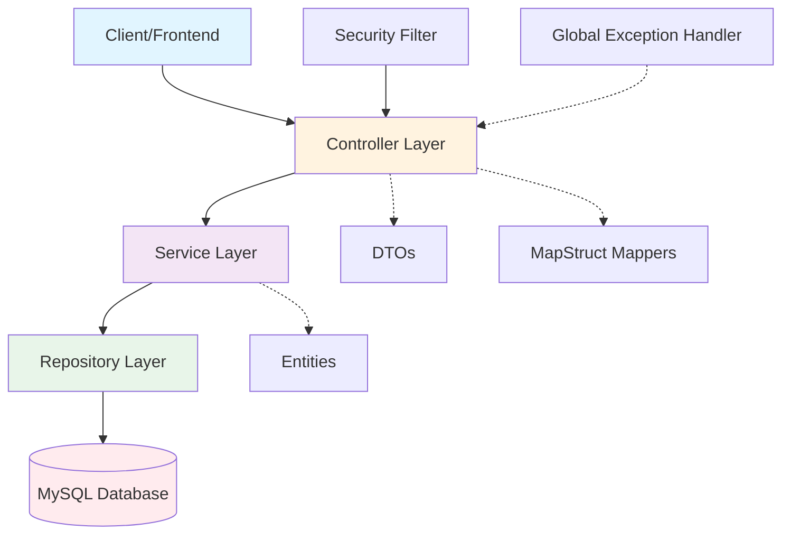

# Backend Architecture

Iquea Commerce follows a **layered architecture** pattern, separating concerns into distinct layers that communicate through well-defined interfaces.

## Architecture Diagram



## Layered Architecture Pattern

### 1. Controller Layer

Controllers handle HTTP requests and responses. They are responsible for:
- Receiving and validating requests
- Calling appropriate service methods
- Converting entities to DTOs (via MapStruct)
- Returning HTTP responses

**Example: ProductoController**

```java
package com.edu.mcs.Iquea.controllers;

import org.springframework.http.HttpStatus;
import org.springframework.http.ResponseEntity;
import org.springframework.web.bind.annotation.*;

import com.edu.mcs.Iquea.mappers.ProductoMapper;
import com.edu.mcs.Iquea.models.Producto;
import com.edu.mcs.Iquea.models.dto.detalle.ProductoDetalleDTO;
import com.edu.mcs.Iquea.services.implementaciones.ProductoServiceImpl;

import java.util.List;

@RestController
@RequestMapping("/api/productos")
public class ProductoController {

    private final ProductoServiceImpl productoService;
    private final ProductoMapper productoMapper;

    public ProductoController(ProductoMapper productoMapper, 
                            ProductoServiceImpl productoService) {
        this.productoMapper = productoMapper;
        this.productoService = productoService;
    }

    @GetMapping
    public ResponseEntity<List<ProductoDetalleDTO>> listarTodos() {
        List<Producto> productos = productoService.obtenertodoslosproductos();
        return ResponseEntity.ok(productoMapper.toDTOlist(productos));
    }

    @GetMapping("/{id}")
    public ResponseEntity<ProductoDetalleDTO> obtenerPorId(@PathVariable Long id) {
        return productoService.obtenerProductoPorId(id)
                .map(p -> ResponseEntity.ok(productoMapper.toDTO(p)))
                .orElse(ResponseEntity.notFound().build());
    }

    @PostMapping
    public ResponseEntity<ProductoDetalleDTO> crear(@RequestBody ProductoDetalleDTO dto) {
        Producto creado = productoService.crearProducto(dto);
        return ResponseEntity.status(HttpStatus.CREATED)
                .body(productoMapper.toDTO(creado));
    }

    @PutMapping("/sku/{sku}")
    public ResponseEntity<ProductoDetalleDTO> actualizar(
            @PathVariable String sku,
            @RequestBody ProductoDetalleDTO dto) {
        Producto actualizado = productoService.actualizarProducto(sku, dto);
        return ResponseEntity.ok(productoMapper.toDTO(actualizado));
    }

    @DeleteMapping("/{id}")
    public ResponseEntity<Void> eliminar(@PathVariable Long id) {
        productoService.borrarProducto(id);
        return ResponseEntity.noContent().build();
    }
}
```

**Key characteristics:**
- `@RestController` - Combines `@Controller` and `@ResponseBody`
- `@RequestMapping` - Defines base path for all endpoints
- Constructor injection - Spring automatically injects dependencies
- DTOs instead of entities - Never expose entities directly to clients

### 2. Service Layer

Services contain business logic and orchestrate data operations. They:
- Implement business rules and validation
- Coordinate between multiple repositories
- Handle transactions
- Process domain logic

**Interface definition:**

```java
package com.edu.mcs.Iquea.services;

import com.edu.mcs.Iquea.models.Producto;
import com.edu.mcs.Iquea.models.dto.detalle.ProductoDetalleDTO;

import java.util.List;
import java.util.Optional;

public interface IProductoService {
    
    Producto crearProducto(ProductoDetalleDTO dto);
    Optional<Producto> obtenerProductoPorId(Long id);
    List<Producto> obtenertodoslosproductos();
    Producto actualizarProducto(String sku, ProductoDetalleDTO dto);
    void borrarProducto(Long id);
    Optional<Producto> obtenerProductoPorSku(String sku);
}
```

**Service implementation:**

```java
package com.edu.mcs.Iquea.services.implementaciones;

import org.springframework.stereotype.Service;
import org.springframework.transaction.annotation.Transactional;

import com.edu.mcs.Iquea.mappers.ProductoMapper;
import com.edu.mcs.Iquea.models.Producto;
import com.edu.mcs.Iquea.models.dto.detalle.ProductoDetalleDTO;
import com.edu.mcs.Iquea.repositories.ProductoRepository;
import com.edu.mcs.Iquea.services.IProductoService;

import java.util.List;
import java.util.Optional;

@Service
public class ProductoServiceImpl implements IProductoService {

    private final ProductoRepository productoRepository;
    private final ProductoMapper productoMapper;

    public ProductoServiceImpl(ProductoMapper productoMapper, 
                             ProductoRepository productoRepository) {
        this.productoMapper = productoMapper;
        this.productoRepository = productoRepository;
    }

    @Override
    @Transactional
    public Producto crearProducto(ProductoDetalleDTO dto) {
        if (productoRepository.existsBySku(dto.getSku())) {
            throw new IllegalArgumentException(
                "Ya existe un producto con el SKU: " + dto.getSku()
            );
        }
        Producto producto = productoMapper.toEntity(dto);
        return productoRepository.save(producto);
    }

    @Override
    @Transactional(readOnly = true)
    public Optional<Producto> obtenerProductoPorId(Long id) {
        return productoRepository.findById(id);
    }

    @Override
    @Transactional(readOnly = true)
    public List<Producto> obtenertodoslosproductos() {
        return productoRepository.findAll();
    }
}
```

**Key characteristics:**
- `@Service` - Marks as a service component
- `@Transactional` - Manages database transactions
- `readOnly = true` - Optimizes read-only operations
- Business validation - Checks SKU uniqueness before creating

### 3. Repository Layer

Repositories provide data access through Spring Data JPA. They:
- Extend `JpaRepository` for CRUD operations
- Define custom queries with `@Query` or method naming
- Abstract database operations

**Example repository:**

```java
package com.edu.mcs.Iquea.repositories;

import com.edu.mcs.Iquea.models.Producto;
import org.springframework.data.jpa.repository.JpaRepository;
import org.springframework.data.jpa.repository.Query;
import org.springframework.data.repository.query.Param;

import java.math.BigDecimal;
import java.util.List;
import java.util.Optional;

public interface ProductoRepository extends JpaRepository<Producto, Long> {

    // Method name query - Spring generates SQL automatically
    boolean existsBySku(String sku);
    Optional<Producto> findBySku(String sku);
    
    // Complex method name query
    List<Producto> findByNombreContainingIgnoreCaseOrDescripcionContainingIgnoreCase(
        String nombre, String descripcion
    );

    // Custom JPQL query
    @Query("SELECT p FROM Producto p WHERE p.categoria.categoria_id = :categoriaId")
    List<Producto> findByCategoriaId(@Param("categoriaId") Long categoriaId);

    @Query("SELECT p FROM Producto p WHERE p.es_destacado = :es_destacado")
    List<Producto> findByEs_destacado(@Param("es_destacado") Boolean es_destacado);

    // Query using embedded value object
    List<Producto> findByPrecioCantidadBetween(
        BigDecimal precioMinimo, BigDecimal precioMaximo
    );
}
```

**Key characteristics:**
- No implementation needed - Spring generates it
- Type-safe queries through method names
- Support for JPQL and native SQL
- Pagination and sorting built-in

## DTO Pattern with MapStruct

### Why DTOs?

1. **Decoupling** - API contracts independent of domain model
2. **Security** - Don't expose internal entity structure
3. **Flexibility** - Different views of the same entity
4. **Performance** - Send only required data

### DTO Types

**Detalle (Detail) DTOs** - Complete entity representation:
```
ProductoDetalleDTO
UsuarioDetalleDTO
PedidoDetalleDTO
```

**Resumen (Summary) DTOs** - Simplified view:
```
ProductoResumenDTO
UsuarioResumenDTO
CategoriaResumenDTO
```

### MapStruct Mapping

**ProductoMapper example:**

```java
package com.edu.mcs.Iquea.mappers;

import org.mapstruct.Mapper;
import org.mapstruct.Mapping;
import org.mapstruct.MappingTarget;

import com.edu.mcs.Iquea.models.Producto;
import com.edu.mcs.Iquea.models.dto.detalle.ProductoDetalleDTO;

import java.util.List;

@Mapper(componentModel = "spring", uses = {CategoriaMapperResumen.class})
public interface ProductoMapper {

    // Entity to DTO - Flatten value objects
    @Mapping(source = "precio.cantidad", target = "precioCantidad")
    @Mapping(source = "precio.moneda", target = "precioMoneda")
    @Mapping(source = "dimensiones.alto", target = "dimensionesAlto")
    @Mapping(source = "dimensiones.ancho", target = "dimensionesAncho")
    @Mapping(source = "dimensiones.profundidad", target = "dimensionesProfundo")
    ProductoDetalleDTO toDTO(Producto producto);

    // DTO to Entity - Reconstruct value objects
    @Mapping(target = "precio", 
             expression = "java(new Precio(dto.getPrecioCantidad(), dto.getPrecioMoneda()))")
    @Mapping(target = "dimensiones", 
             expression = "java(new Dimensiones(dto.getDimensionesAlto(), dto.getDimensionesAncho(), dto.getDimensionesProfundo()))")
    Producto toEntity(ProductoDetalleDTO dto);

    // Batch conversion
    List<ProductoDetalleDTO> toDTOlist(List<Producto> productos);

    // Update existing entity
    @Mapping(target = "precio", 
             expression = "java(new Precio(dto.getPrecioCantidad(), dto.getPrecioMoneda()))")
    void updatefromEntity(ProductoDetalleDTO dto, @MappingTarget Producto producto);
}
```

## Exception Handling

**Global exception handler:**

```java
package com.edu.mcs.Iquea.exceptions;

import org.springframework.http.HttpStatus;
import org.springframework.http.ResponseEntity;
import org.springframework.web.bind.annotation.ExceptionHandler;
import org.springframework.web.bind.annotation.RestControllerAdvice;

@RestControllerAdvice
public class GlobalExceptionHandler {

    // 400 — Invalid data (duplicate email, SKU, etc.)
    @ExceptionHandler(IllegalArgumentException.class)
    public ResponseEntity<ApiError> handleIllegalArgument(IllegalArgumentException ex) {
        return ResponseEntity
                .status(HttpStatus.BAD_REQUEST)
                .body(new ApiError(400, ex.getMessage()));
    }

    // 404 — Resource not found
    @ExceptionHandler(RuntimeException.class)
    public ResponseEntity<ApiError> handleRuntime(RuntimeException ex) {
        if (ex.getMessage() != null && 
            ex.getMessage().toLowerCase().contains("no encontr")) {
            return ResponseEntity
                    .status(HttpStatus.NOT_FOUND)
                    .body(new ApiError(404, ex.getMessage()));
        }
        return ResponseEntity
                .status(HttpStatus.INTERNAL_SERVER_ERROR)
                .body(new ApiError(500, "Error interno del servidor"));
    }

    // 500 — Any other error
    @ExceptionHandler(Exception.class)
    public ResponseEntity<ApiError> handleGeneric(Exception ex) {
        return ResponseEntity
                .status(HttpStatus.INTERNAL_SERVER_ERROR)
                .body(new ApiError(500, "Error interno del servidor"));
    }
}
```

## Benefits of This Architecture

<CardGroup cols={2}>
  <Card title="Separation of Concerns" icon="layer-group">
    Each layer has a single, well-defined responsibility
  </Card>
  <Card title="Testability" icon="flask">
    Easy to unit test each layer independently
  </Card>
  <Card title="Maintainability" icon="wrench">
    Changes in one layer don't affect others
  </Card>
  <Card title="Scalability" icon="arrow-up-right-dots">
    Easy to add new features following the same pattern
  </Card>
</CardGroup>

## Request Flow Example

**Creating a new product:**

1. **Client** sends POST request to `/api/productos`
2. **JwtFilter** validates authentication token
3. **SecurityConfig** checks ADMIN role authorization
4. **ProductoController** receives request and DTO
5. **ProductoMapper** converts DTO to Entity
6. **ProductoService** validates business rules (SKU uniqueness)
7. **ProductoRepository** saves to database
8. **Service** returns saved entity
9. **Mapper** converts entity back to DTO
10. **Controller** returns HTTP 201 with DTO

<Note>
This clean separation makes the codebase maintainable and allows developers to work on different layers simultaneously without conflicts.
</Note>