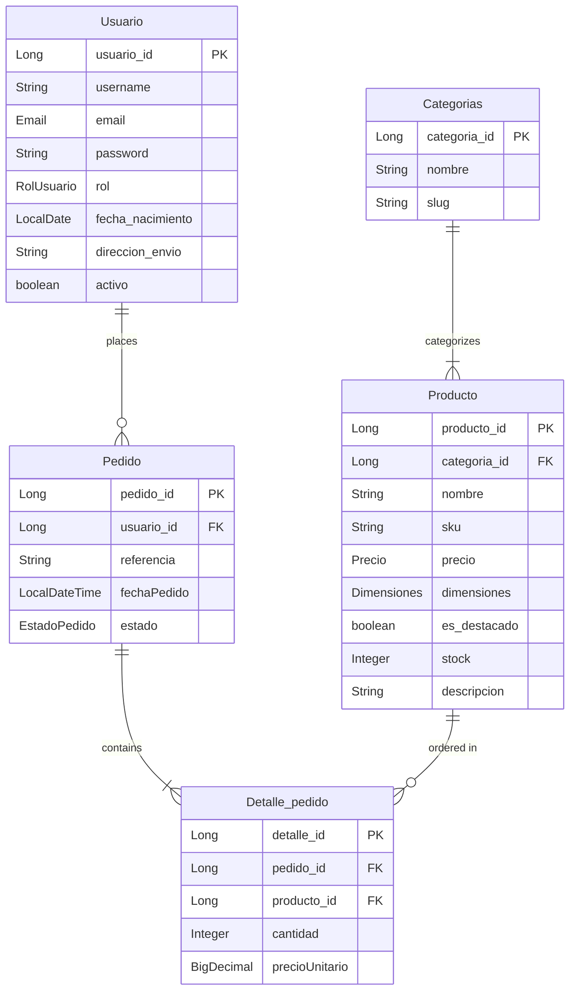

# Domain Model

The Iquea Commerce domain model represents the core business entities and their relationships. It follows Domain-Driven Design principles with rich entities and value objects.

## Entity Overview



## Core Entities

### Usuario (User)

Represents users of the e-commerce platform (customers and administrators).

```java
package com.edu.mcs.Iquea.models;

import java.time.LocalDate;
import com.edu.mcs.Iquea.models.Enums.RolUsuario;
import com.edu.mcs.Iquea.models.Vo.Email;
import jakarta.persistence.*;

@Entity
@Table(name = "Usuario")
public class Usuario {

    @Id
    @GeneratedValue(strategy = GenerationType.IDENTITY)
    private Long usuario_id;

    @Column(name = "username", length = 100, nullable = false)
    private String username;

    @Column(name = "fecha_nacimiento", length = 100, nullable = false)
    private LocalDate fecha_nacimiento;

    @Column(name = "direccion_envio", nullable = false)
    private String direccion_envio;

    @Enumerated(EnumType.STRING)
    @Column(name = "rol", nullable = false)
    private RolUsuario rol = RolUsuario.CLIENTE;

    @Embedded
    @AttributeOverride(name = "value", 
                      column = @Column(name = "Email", 
                                      nullable = false, 
                                      unique = true))
    private Email email;

    @Column(name = "nombre", length = 100, nullable = false)
    private String nombre;

    @Column(name = "apellidos", length = 150, nullable = false)
    private String apellidos;

    @Column(name = "activo")
    private boolean activo;

    @Column(name = "password", nullable = false)
    private String password;

    // Constructors, getters, setters...
}
```

**Key annotations:**
- `@Entity` - Marks as JPA entity
- `@Table(name = "Usuario")` - Maps to Usuario table
- `@Id` + `@GeneratedValue` - Auto-incrementing primary key
- `@Embedded` - Uses value object Email
- `@Enumerated(EnumType.STRING)` - Stores enum as string

**Roles:**
```java
public enum RolUsuario {
    ADMIN,    // Can manage products, categories
    CLIENTE   // Can browse and place orders
}
```

### Producto (Product)

Represents furniture products sold in the store.

```java
package com.edu.mcs.Iquea.models;

import com.edu.mcs.Iquea.models.Vo.Dimensiones;
import com.edu.mcs.Iquea.models.Vo.Precio;
import jakarta.persistence.*;

@Entity
@Table(name = "Producto")
public class Producto {

    @Id
    @GeneratedValue(strategy = GenerationType.IDENTITY)
    private Long producto_id;

    @ManyToOne(fetch = FetchType.LAZY)
    @JoinColumn(name = "categoria_id")
    private Categorias categoria;

    @Column(name = "nombre", length = 155, nullable = false)
    private String nombre;

    @Column(name = "sku", unique = true, nullable = false, length = 50)
    private String sku;

    @Embedded
    @AttributeOverrides({
        @AttributeOverride(name = "cantidad", 
                          column = @Column(name = "Cantidad", nullable = false, scale = 2)),
        @AttributeOverride(name = "moneda", 
                          column = @Column(name = "Moneda", nullable = false, length = 3))
    })
    private Precio precio;

    @Column(name = "es_destacado")
    private boolean es_destacado;

    @Embedded
    @AttributeOverrides({
        @AttributeOverride(name = "alto", 
                          column = @Column(name = "Alto", nullable = false)),
        @AttributeOverride(name = "ancho", 
                          column = @Column(name = "Ancho", nullable = false)),
        @AttributeOverride(name = "profundidad", 
                          column = @Column(name = "Profundidad", nullable = false))
    })
    private Dimensiones dimensiones;

    @Column(name = "descripcion", columnDefinition = "TEXT")
    private String descripcion;

    @Column(name = "stock", nullable = false)
    private Integer stock = 0;

    @Column(name = "imagen_url")
    private String imagenUrl;

    // Method to maintain bidirectional relationship
    public void vincularCategoria(Categorias categoria) {
        if (this.categoria == categoria) {
            return;
        }
        if (this.categoria != null) {
            this.categoria.getProductos().remove(this);
        }
        this.categoria = categoria;
        if (categoria != null && !categoria.getProductos().contains(this)) {
            categoria.getProductos().add(this);
        }
    }

    // Constructors, getters, setters...
}
```

**Key features:**
- **SKU** - Unique product identifier
- **Embedded value objects** - Precio and Dimensiones
- **Lazy loading** - Category loaded only when accessed
- **Bidirectional relationship** - Maintains consistency with Categoria

### Categorias (Category)

Organizes products into categories (e.g., Salón, Dormitorio, Cocina).

```java
package com.edu.mcs.Iquea.models;

import jakarta.persistence.*;
import java.util.List;

@Entity
@Table(name="categorias")
public class Categorias {
    
    @Id
    @GeneratedValue(strategy= GenerationType.IDENTITY)
    private Long categoria_id;

    @Column(name = "nombre", length = 200, nullable = false)
    private String nombre;

    @Column(name = "Slug", length = 155, nullable = false)
    private String slug;

    @OneToMany(mappedBy= "categoria", fetch=FetchType.LAZY)
    private List<Producto> productos;

    public void agregarProducto(Producto producto) {
        if (producto == null) {
            throw new IllegalArgumentException("El producto no puede ser nulo");
        }
        if (!this.productos.contains(producto)) {
            this.productos.add(producto);
            producto.vincularCategoria(this);
        }
    }
    
    public void removerProducto(Producto producto) {
        if (producto != null && this.productos.contains(producto)) {
            this.productos.remove(producto);
        }
    }

    // Constructors, getters, setters...
}
```

**Key features:**
- **Slug** - URL-friendly identifier (e.g., "salon", "dormitorio")
- **One-to-Many** - One category has many products
- **Domain methods** - Business logic for managing products

### Pedido (Order)

Represents a customer order.

```java
package com.edu.mcs.Iquea.models;

import java.math.BigDecimal;
import java.time.LocalDateTime;
import java.util.ArrayList;
import java.util.List;
import com.edu.mcs.Iquea.models.Enums.EstadoPedido;
import jakarta.persistence.*;

@Entity
@Table(name = "Pedidos")
public class Pedido {

    @Id
    @GeneratedValue(strategy = GenerationType.IDENTITY)
    private Long pedido_id;

    @ManyToOne
    @JoinColumn(name = "usuario_id", nullable = false)
    private Usuario usuario;

    @Column(name = "fecha_pedido", nullable = false)
    private LocalDateTime fechaPedido;

    @Enumerated(EnumType.STRING)
    @Column(name = "estado", nullable = false)
    private EstadoPedido estado;

    @Column(name = "referencia", unique = true, nullable = false, length = 10)
    private String referencia;

    @OneToMany(mappedBy = "pedido", cascade = CascadeType.ALL, orphanRemoval = true)
    private List<Detalle_pedido> detalles = new ArrayList<>();

    // Auto-generate unique reference code
    @PrePersist
    private void generarReferencia() {
        if (this.referencia == null) {
            this.referencia = generarCodigoAleatorio();
        }
    }

    public static String generarCodigoAleatorio() {
        String caracteres = "ABCDEFGHJKLMNPQRSTUVWXYZ0123456789";
        java.security.SecureRandom random = new java.security.SecureRandom();
        StringBuilder codigo = new StringBuilder(10);
        for (int i = 0; i < 10; i++) {
            codigo.append(caracteres.charAt(random.nextInt(caracteres.length())));
        }
        return codigo.toString();
    }

    // Domain method to add products
    public void agregarProducto(Producto producto, Integer cantidad) {
        if (producto == null) {
            throw new IllegalArgumentException("El producto no puede ser nulo");
        }
        if (cantidad == null || cantidad <= 0) {
            throw new IllegalArgumentException("La cantidad debe ser mayor a 0");
        }
        Detalle_pedido detalle = new Detalle_pedido(
            this, producto, cantidad, producto.getPrecio().getCantidad()
        );
        this.detalles.add(detalle);
    }

    // Calculate total order amount
    public BigDecimal calcularTotal() {
        return detalles.stream()
                .map(detalle -> detalle.getPrecioUnitario()
                        .multiply(new BigDecimal(detalle.getCantidad())))
                .reduce(BigDecimal.ZERO, BigDecimal::add);
    }

    // Constructors, getters, setters...
}
```

**Order states:**
```java
public enum EstadoPedido {
    PENDIENTE,  // Order created, awaiting payment
    PAGADO,     // Payment confirmed
    ENVIADO,    // Shipped to customer
    ENTREGADO,  // Delivered
    CANCELADO   // Cancelled
}
```

**Key features:**
- **Auto-generated reference** - Unique 10-character code
- **Cascade operations** - Deleting order deletes all details
- **Domain logic** - Methods for adding products and calculating total
- `@PrePersist` - Runs before entity is saved to database

### Detalle_pedido (Order Detail)

Represents individual items in an order.

```java
package com.edu.mcs.Iquea.models;

import java.math.BigDecimal;
import jakarta.persistence.*;

@Entity
@Table(name="Detalle_pedido")
public class Detalle_pedido {
    
    @Id
    @GeneratedValue(strategy=GenerationType.IDENTITY)
    private Long detalle_id;

    @ManyToOne(fetch=FetchType.LAZY)
    @JoinColumn(name="pedido_id", nullable=false)
    private Pedido pedido;

    @ManyToOne(fetch = FetchType.LAZY)
    @JoinColumn(name = "producto_id", nullable = false)
    private Producto producto;

    @Column(nullable = false)
    private Integer cantidad;

    @Column(name = "precio_unitario", nullable = false, scale = 2)
    private BigDecimal precioUnitario;

    // Constructors, getters, setters...
}
```

**Key features:**
- **Snapshot price** - Stores price at time of order (immutable)
- **Many-to-One** - Links to both Pedido and Producto
- **Part of order lifecycle** - Managed by cascade operations

## Value Objects

Value objects are immutable objects defined by their attributes, not identity. They encapsulate business rules and validation.

### Email

Encapsulates email validation logic.

```java
package com.edu.mcs.Iquea.models.Vo;

import java.util.Objects;
import java.util.regex.Pattern;
import jakarta.persistence.Embeddable;

@Embeddable
public final class Email {
    public final String value;

    public static final Pattern PATTERN = 
        Pattern.compile("^[A-Za-z0-9+_.-]+@[A-Za-z0-9.-]+$");

    protected Email() {
        this.value = "invalid@email";
    }

    public Email(String value) {
        validate(value);
        this.value = value;
    }

    private void validate(String value) {
        if (value == null || value.isBlank()) {
            throw new IllegalArgumentException("El email no puede ser nulo");
        }
        if (!PATTERN.matcher(value).matches()) {
            throw new IllegalArgumentException("Formato de email invalido");
        }
    }

    public String getValue() {
        return value;
    }

    @Override
    public boolean equals(Object o) {
        if (this == o) return true;
        if (!(o instanceof Email other)) return false;
        return Objects.equals(value, other.value);
    }

    @Override
    public int hashCode() {
        return Objects.hash(value);
    }
}
```

### Precio (Price)

Encapsulates monetary value with currency.

```java
package com.edu.mcs.Iquea.models.Vo;

import java.math.BigDecimal;
import java.math.RoundingMode;
import jakarta.persistence.Embeddable;

@Embeddable
public final class Precio {
    private final BigDecimal cantidad;
    private final String moneda;

    protected Precio() {
        this.cantidad = BigDecimal.ZERO.setScale(2, RoundingMode.HALF_UP);
        this.moneda = "EUR";
    }

    public Precio(BigDecimal cantidad, String moneda) {
        validate(cantidad, moneda);
        this.cantidad = cantidad.setScale(2, RoundingMode.HALF_UP);
        this.moneda = moneda.toUpperCase();
    }

    private void validate(BigDecimal cantidad, String moneda) {
        if (cantidad == null) {
            throw new IllegalArgumentException("El precio no puede ser nulo");
        }
        if (cantidad.compareTo(BigDecimal.ZERO) < 0) {
            throw new IllegalArgumentException("El precio no puede ser negativo");
        }
        if (moneda == null || moneda.isBlank()) {
            throw new IllegalArgumentException(
                "La moneda no puede ser nula ni vacia"
            );
        }
    }

    public BigDecimal getCantidad() {
        return cantidad;
    }

    public String getMoneda() {
        return moneda;
    }

    @Override
    public boolean equals(Object o) {
        if (this == o) return true;
        if (!(o instanceof Precio other)) return false;
        return cantidad.compareTo(other.cantidad) == 0 && 
               moneda.equals(other.moneda);
    }
}
```

**Benefits:**
- Prevents negative prices
- Ensures consistent precision (2 decimals)
- Type-safe currency handling

### Dimensiones (Dimensions)

Encapsulates product physical dimensions.

```java
package com.edu.mcs.Iquea.models.Vo;

import java.util.Objects;
import jakarta.persistence.Embeddable;

@Embeddable
public final class Dimensiones {
    public final Double ancho;
    public final Double alto;
    public final Double profundidad;

    protected Dimensiones() {
        this.ancho = 0.0;
        this.alto = 0.0;
        this.profundidad = 0.0;
    }

    public Dimensiones(Double alto, Double ancho, Double profundidad) {
        this.alto = alto;
        this.ancho = ancho;
        this.profundidad = profundidad;
        validate();
    }

    private void validate() {
        if (alto == null || ancho == null || profundidad == null) {
            throw new IllegalArgumentException(
                "Las dimensiones no pueden ser nulas"
            );
        }
        if (alto <= 0 || ancho <= 0 || profundidad <= 0) {
            throw new IllegalArgumentException(
                "Las dimensiones deben ser mayores que 0"
            );
        }
    }

    // Getters, equals, hashCode...
}
```

**Benefits:**
- Ensures all dimensions are positive
- Immutable - cannot be changed after creation
- Self-validating

## Relationships Summary

| Relationship | Type | Description |
|--------------|------|-------------|
| Usuario → Pedido | One-to-Many | User can have multiple orders |
| Categorias → Producto | One-to-Many | Category contains multiple products |
| Pedido → Detalle_pedido | One-to-Many (cascade) | Order has multiple line items |
| Producto → Detalle_pedido | One-to-Many | Product can appear in multiple orders |

<Note>
All relationships use `FetchType.LAZY` to optimize performance by loading related entities only when accessed.
</Note>

## Domain-Driven Design Principles

<CardGroup cols={2}>
  <Card title="Rich Domain Model" icon="gem">
    Entities contain business logic, not just data (e.g., `agregarProducto()`, `calcularTotal()`)
  </Card>
  <Card title="Value Objects" icon="shield-check">
    Immutable objects with built-in validation (Email, Precio, Dimensiones)
  </Card>
  <Card title="Encapsulation" icon="lock">
    Internal state protected, accessed through methods
  </Card>
  <Card title="Domain Events" icon="bolt">
    Lifecycle callbacks (`@PrePersist`) for automatic behavior
  </Card>
</CardGroup>