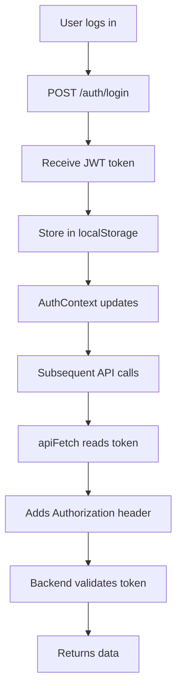

# API Integration

The Iquea frontend communicates with the backend through a type-safe REST API client located in `src/api/`. All API modules use a shared client with automatic JWT authentication.

## API Architecture

<CardGroup cols={2}>
  <Card title="Base Client" icon="plug">
    Shared HTTP client with auth headers
  </Card>
  <Card title="Service Modules" icon="folder-tree">
    Domain-specific API functions
  </Card>
  <Card title="Type Safety" icon="shield">
    TypeScript interfaces for all requests/responses
  </Card>
  <Card title="JWT Auth" icon="key">
    Automatic token injection from localStorage
  </Card>
</CardGroup>

## Base API Client

The foundation of all API calls is the `apiFetch` function in `client.ts`:

```typescript src/api/client.ts
const BASE_URL = 'http://localhost:8080/api';

function getToken(): string | null {
    return localStorage.getItem('token');
}

function authHeaders(): HeadersInit {
    const token = getToken();
    return {
        'Content-Type': 'application/json',
        ...(token ? { Authorization: `Bearer ${token}` } : {}),
    };
}

export async function apiFetch<T>(
    path: string,
    options: RequestInit = {}
): Promise<T> {
    const res = await fetch(`${BASE_URL}${path}`, {
        ...options,
        headers: {
            ...authHeaders(),
            ...(options.headers ?? {}),
        },
    });

    if (!res.ok) {
        const error = await res.json().catch(() => ({ message: 'Error desconocido' }));
        throw new Error(error.message ?? `Error ${res.status}`);
    }

    return res.json() as Promise<T>;
}
```

### Key Features

<Tabs>
  <Tab title="Automatic Auth">
    The client automatically includes JWT tokens from localStorage:
    ```typescript
    function authHeaders(): HeadersInit {
        const token = getToken();
        return {
            'Content-Type': 'application/json',
            ...(token ? { Authorization: `Bearer ${token}` } : {}),
        };
    }
    ```
    If a token exists, it's added as `Authorization: Bearer <token>`.
  </Tab>
  
  <Tab title="Generic Types">
    Type-safe responses using TypeScript generics:
    ```typescript
    export async function apiFetch<T>(
        path: string,
        options: RequestInit = {}
    ): Promise<T>
    ```
    This ensures the returned data matches expected types.
  </Tab>
  
  <Tab title="Error Handling">
    Automatically throws errors for non-2xx responses:
    ```typescript
    if (!res.ok) {
        const error = await res.json().catch(() => ({ message: 'Error desconocido' }));
        throw new Error(error.message ?? `Error ${res.status}`);
    }
    ```
    Callers can catch and handle errors appropriately.
  </Tab>
</Tabs>

## Authentication API

Handles user login and registration.

```typescript src/api/auth.ts
import { apiFetch } from './client';
import type { LoginDTO, RegistroDTO, TokenDTO } from '../types';

export function login(data: LoginDTO): Promise<TokenDTO> {
    return apiFetch<TokenDTO>('/auth/login', {
        method: 'POST',
        body: JSON.stringify(data),
    });
}

export function registro(data: RegistroDTO): Promise<TokenDTO> {
    return apiFetch<TokenDTO>('/auth/registro', {
        method: 'POST',
        body: JSON.stringify(data),
    });
}
```

### Type Definitions

```typescript src/types/index.ts
export interface LoginDTO {
    email: string;
    password: string;
}

export interface RegistroDTO {
    username: string;
    nombre: string;
    apellidos: string;
    email: { value: string };
    password: string;
    fecha_nacimiento: string; // "YYYY-MM-DD"
    direccion_envio?: string;
}

export interface TokenDTO {
    token: string;
}
```

### Usage Example

```typescript src/pages/Login.tsx
import { login } from '../api/auth';
import { useAuth } from '../context/AuthContext';
import { useState } from 'react';
import { useNavigate } from 'react-router-dom';

function Login() {
    const { setToken } = useAuth();
    const navigate = useNavigate();
    const [credentials, setCredentials] = useState({ email: '', password: '' });
    const [error, setError] = useState('');

    async function handleSubmit(e: React.FormEvent) {
        e.preventDefault();
        try {
            const { token } = await login(credentials);
            setToken(token);
            navigate('/');
        } catch (err) {
            setError(err instanceof Error ? err.message : 'Login failed');
        }
    }

    // Render form...
}
```

## Products API

Fetches product data with various filtering options.

```typescript src/api/productos.ts
import { apiFetch } from './client';
import type { Producto } from '../types';

export function getProductos(): Promise<Producto[]> {
    return apiFetch<Producto[]>('/productos');
}

export function getProducto(id: number): Promise<Producto> {
    return apiFetch<Producto>(`/productos/${id}`);
}

export function getDestacados(): Promise<Producto[]> {
    return apiFetch<Producto[]>('/productos/destacados');
}

export function buscarProductos(texto: string): Promise<Producto[]> {
    return apiFetch<Producto[]>(`/productos/buscar?nombre=${encodeURIComponent(texto)}`);
}

export function getProductosPorCategoria(categoriaId: number): Promise<Producto[]> {
    return apiFetch<Producto[]>(`/productos/categoria/${categoriaId}`);
}

export function getProductosPorPrecio(min: number, max: number): Promise<Producto[]> {
    return apiFetch<Producto[]>(`/productos/precio?min=${min}&max=${max}`);
}
```

### API Endpoints

| Function | Method | Endpoint | Description |
|----------|--------|----------|-------------|
| `getProductos()` | GET | `/productos` | Get all products |
| `getProducto(id)` | GET | `/productos/{id}` | Get single product |
| `getDestacados()` | GET | `/productos/destacados` | Get featured products |
| `buscarProductos(texto)` | GET | `/productos/buscar?nombre={texto}` | Search by name |
| `getProductosPorCategoria(id)` | GET | `/productos/categoria/{id}` | Filter by category |
| `getProductosPorPrecio(min, max)` | GET | `/productos/precio?min={min}&max={max}` | Filter by price range |

### Product Type

```typescript src/types/index.ts
export interface Producto {
    producto_id: number;
    sku: string;
    nombre: string;
    descripcion: string;
    precioCantidad: number;
    precioMoneda: string;
    dimensionesAlto: number;
    dimensionesAncho: number;
    dimensionesProfundo: number;
    es_destacado: boolean;
    stock: number;
    imagen_url: string;
    categoria: CategoriaResumen;
}

export interface CategoriaResumen {
    categoria_id: number;
    nombre: string;
    slug: string;
}
```

### Usage Example

```typescript src/pages/ProductList.tsx
import { getProductos, buscarProductos } from '../api/productos';
import { useState, useEffect } from 'react';
import { useSearchParams } from 'react-router-dom';
import ProductoCard from '../components/ProductoCard';

function ProductList() {
    const [productos, setProductos] = useState<Producto[]>([]);
    const [loading, setLoading] = useState(true);
    const [searchParams] = useSearchParams();
    const searchQuery = searchParams.get('q');

    useEffect(() => {
        async function fetchData() {
            setLoading(true);
            try {
                const data = searchQuery
                    ? await buscarProductos(searchQuery)
                    : await getProductos();
                setProductos(data);
            } catch (error) {
                console.error('Failed to fetch products:', error);
            } finally {
                setLoading(false);
            }
        }
        fetchData();
    }, [searchQuery]);

    if (loading) return <p>Loading...</p>;

    return (
        <div className="product-grid">
            {productos.map((producto) => (
                <ProductoCard key={producto.producto_id} producto={producto} />
            ))}
        </div>
    );
}
```

## Categories API

Fetches product categories.

```typescript src/api/categorias.ts
import { apiFetch } from './client';
import type { CategoriaResumen } from '../types';

export function getCategorias(): Promise<CategoriaResumen[]> {
    return apiFetch<CategoriaResumen[]>('/categorias');
}
```

## Orders API

Handles order creation and management (requires authentication).

```typescript src/api/pedidos.ts
import { apiFetch } from './client';
import type { Pedido, DetallePedido } from '../types';

export function getPedidos(): Promise<Pedido[]> {
    return apiFetch<Pedido[]>('/pedidos');
}

export function getPedido(id: number): Promise<Pedido> {
    return apiFetch<Pedido>(`/pedidos/${id}`);
}

export function crearPedido(usuarioId: number): Promise<Pedido> {
    return apiFetch<Pedido>('/pedidos', {
        method: 'POST',
        body: JSON.stringify({ usuario_id: usuarioId }),
    });
}

export function getDetallesPedido(pedidoId: number): Promise<DetallePedido[]> {
    return apiFetch<DetallePedido[]>(`/pedidos/${pedidoId}/detalles`);
}

export function anhadirDetalle(
    pedidoId: number,
    productoId: number,
    cantidad: number
): Promise<DetallePedido> {
    return apiFetch<DetallePedido>(`/pedidos/${pedidoId}/detalles`, {
        method: 'POST',
        body: JSON.stringify({ producto_id: productoId, cantidad }),
    });
}

export function eliminarDetalle(detalleId: number): Promise<void> {
    return apiFetch<void>(`/detalles/${detalleId}`, { method: 'DELETE' });
}

export function actualizarCantidad(detalleId: number, cantidad: number): Promise<DetallePedido> {
    return apiFetch<DetallePedido>(`/detalles/${detalleId}/cantidad?cantidad=${cantidad}`, {
        method: 'PUT',
    });
}
```

### Order Types

```typescript src/types/index.ts
export type EstadoPedido = 'PENDIENTE' | 'CONFIRMADO' | 'ENVIADO' | 'ENTREGADO' | 'CANCELADO';

export interface ProductoResumen {
    producto_id: number;
    nombre: string;
    precioCantidad: number;
    imagen_url: string;
}

export interface DetallePedido {
    detalle_id: number;
    producto: ProductoResumen;
    cantidad: number;
    precioUnitario: number;
    subtotal: number;
}

export interface Pedido {
    pedido_id: number;
    referencia: string;
    fecha_creacion: string;
    estado: EstadoPedido;
    total: number;
    detalles: DetallePedido[];
}
```

### Checkout Flow Example

```typescript src/pages/Cart.tsx
import { crearPedido, anhadirDetalle } from '../api/pedidos';
import { useCart } from '../context/CartContext';
import { useAuth } from '../context/AuthContext';
import { useState } from 'react';

function Cart() {
    const { cart, clearCart } = useCart();
    const { email } = useAuth();  // In real app, get user ID
    const [loading, setLoading] = useState(false);

    async function handleCheckout() {
        setLoading(true);
        try {
            // 1. Create order
            const pedido = await crearPedido(1);  // Use actual user ID

            // 2. Add all cart items to order
            for (const item of cart) {
                await anhadirDetalle(
                    pedido.pedido_id,
                    item.producto.producto_id,
                    item.cantidad
                );
            }

            // 3. Clear cart and show success
            clearCart();
            alert('Order placed successfully!');
        } catch (error) {
            console.error('Checkout failed:', error);
            alert('Failed to place order');
        } finally {
            setLoading(false);
        }
    }

    // Render cart UI...
}
```

## Error Handling

All API functions can throw errors that should be caught:

<Tabs>
  <Tab title="Try-Catch Pattern">
    ```typescript
    import { getProducto } from '../api/productos';
    
    async function loadProduct(id: number) {
        try {
            const producto = await getProducto(id);
            setProducto(producto);
        } catch (error) {
            if (error instanceof Error) {
                setError(error.message);
            } else {
                setError('Unknown error occurred');
            }
        }
    }
    ```
  </Tab>
  
  <Tab title="With Loading State">
    ```typescript
    const [loading, setLoading] = useState(true);
    const [error, setError] = useState<string | null>(null);
    
    useEffect(() => {
        async function fetchData() {
            setLoading(true);
            setError(null);
            try {
                const data = await getProductos();
                setProductos(data);
            } catch (err) {
                setError(err instanceof Error ? err.message : 'Failed to load');
            } finally {
                setLoading(false);
            }
        }
        fetchData();
    }, []);
    
    if (loading) return <Spinner />;
    if (error) return <ErrorMessage message={error} />;
    ```
  </Tab>
  
  <Tab title="Auth Error Handling">
    ```typescript
    try {
        const pedidos = await getPedidos();
    } catch (error) {
        if (error instanceof Error && error.message.includes('401')) {
            // Token expired or invalid
            logout();
            navigate('/login');
        } else {
            setError('Failed to load orders');
        }
    }
    ```
  </Tab>
</Tabs>

## JWT Token Flow

The authentication flow works as follows:



### Token Storage

```typescript
// Login flow
const { token } = await login(credentials);
setToken(token);  // Saves to localStorage via AuthContext

// API client reads token
function getToken(): string | null {
    return localStorage.getItem('token');
}

// Automatically included in headers
function authHeaders(): HeadersInit {
    const token = getToken();
    return {
        'Content-Type': 'application/json',
        ...(token ? { Authorization: `Bearer ${token}` } : {}),
    };
}
```

## API Best Practices

<AccordionGroup>
  <Accordion title="Always Use Type Parameters">
    Specify the expected return type for type safety:
    ```typescript
    // Good
    const productos = await apiFetch<Producto[]>('/productos');
    
    // Bad - loses type information
    const productos = await apiFetch('/productos');
    ```
  </Accordion>

  <Accordion title="URL Encoding">
    Always encode user input in URLs:
    ```typescript
    // Good
    const query = encodeURIComponent(searchText);
    await apiFetch(`/productos/buscar?nombre=${query}`);
    
    // Bad - vulnerable to injection
    await apiFetch(`/productos/buscar?nombre=${searchText}`);
    ```
  </Accordion>

  <Accordion title="Handle All States">
    Manage loading, error, and success states:
    ```typescript
    const [data, setData] = useState<T | null>(null);
    const [loading, setLoading] = useState(true);
    const [error, setError] = useState<string | null>(null);
    ```
  </Accordion>

  <Accordion title="Avoid Race Conditions">
    Use cleanup functions in useEffect:
    ```typescript
    useEffect(() => {
        let cancelled = false;
        
        async function fetchData() {
            const data = await getProductos();
            if (!cancelled) {
                setProductos(data);
            }
        }
        fetchData();
        
        return () => { cancelled = true; };
    }, []);
    ```
  </Accordion>
</AccordionGroup>

## Configuration

The base API URL is hardcoded in `client.ts`:

```typescript
const BASE_URL = 'http://localhost:8080/api';
```

<Warning>
**Production Configuration**: Update `BASE_URL` for production deployments. Consider using environment variables:
```typescript
const BASE_URL = import.meta.env.VITE_API_URL || 'http://localhost:8080/api';
```
</Warning>

## Related Documentation

<CardGroup cols={2}>
  <Card title="State Management" icon="database" href="./state-management">
    See how AuthContext manages JWT tokens
  </Card>
  <Card title="Backend API" icon="server" href="../backend/api-reference">
    Full backend API endpoint documentation
  </Card>
</CardGroup>
