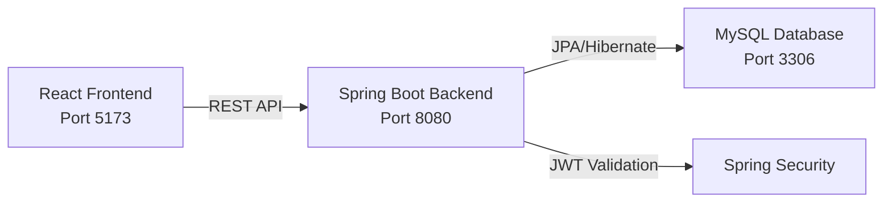

<div className="relative overflow-hidden rounded-xl" style={{
  background: 'linear-gradient(135deg, #0f0733 0%, #14053a 50%, #1a0842 100%)',
  padding: '4rem 2rem',
  marginBottom: '3rem'
}}>
  <div className="relative z-10">
    <div className="inline-block px-4 py-2 rounded-full mb-6" style={{
      background: 'rgba(165, 42, 90, 0.2)',
      border: '1px solid #a52a5a',
      color: '#ff2a6d'
    }}>
      <span className="text-sm font-semibold">Full-Stack E-Commerce Platform</span>
    </div>
    
    <h1 className="text-5xl font-bold mb-4" style={{ color: '#e6e6e6' }}>
      Welcome to Iquea Commerce
    </h1>
    
    <p className="text-xl mb-8" style={{ color: '#e6e6e6', opacity: 0.9, maxWidth: '48rem' }}>
      A modern, production-ready e-commerce solution built with React, Spring Boot, and MySQL. 
      Designed for furniture retail with complete order management, JWT authentication, and role-based access control.
    </p>
    
    <div className="flex gap-4 flex-wrap">
      <a 
        href="/getting-started/prerequisites" 
        className="inline-flex items-center px-6 py-3 font-semibold transition-all"
        style={{
          background: '#a52a5a',
          color: '#ffffff',
          borderRadius: '24px',
          textDecoration: 'none'
        }}
      >
        Get Started →
      </a>
      <a 
        href="/api/auth/login" 
        className="inline-flex items-center px-6 py-3 font-semibold transition-all"
        style={{
          background: 'transparent',
          color: '#ffffff',
          border: '2px solid #ffffff',
          borderRadius: '24px',
          textDecoration: 'none'
        }}
      >
        API Reference
      </a>
    </div>
  </div>
</div>

## What is Iquea Commerce?

Iquea Commerce is a comprehensive e-commerce platform specifically designed for furniture retail businesses. It provides a complete solution with a modern React frontend, robust Spring Boot backend, and MySQL database - all working together to deliver a seamless shopping experience.

The platform handles everything from product catalog management and search functionality to shopping cart operations, order processing, and inventory management. With built-in JWT authentication and role-based access control, it supports both customer and administrator workflows out of the box.

## Key Features

<CardGroup cols={2}>
  <Card title="JWT Authentication" icon="shield-halved" href="/backend/security">
    Secure token-based authentication with Spring Security and role-based access control for Admin and Customer roles
  </Card>
  
  <Card title="Product Catalog" icon="box-open" href="/user-guides/shopping">
    Full-featured product management with categories, search, filtering by price range, and featured product highlighting
  </Card>
  
  <Card title="Shopping Cart & Checkout" icon="cart-shopping" href="/user-guides/cart-checkout">
    Complete shopping cart functionality with real-time stock validation and streamlined checkout process
  </Card>
  
  <Card title="Order Management" icon="clipboard-list" href="/user-guides/order-management">
    Track orders through their lifecycle with status updates, order history, and reference code generation
  </Card>
  
  <Card title="Admin Panel" icon="user-shield" href="/user-guides/admin-panel">
    Powerful admin interface for managing products, categories, inventory, and viewing all orders
  </Card>
  
  <Card title="RESTful API" icon="code" href="/api/auth/login">
    Well-documented REST API with full CRUD operations for products, categories, orders, and users
  </Card>
</CardGroup>

## Technology Stack

Iquea Commerce is built with modern, production-tested technologies:

<Tabs>
  <Tab title="Frontend">
    - **React 19** - Modern UI library with hooks and functional components
    - **TypeScript 5** - Type-safe development with full IDE support
    - **Vite 7** - Lightning-fast build tool and dev server
    - **React Router 7** - Client-side routing with nested routes
    - **Pure CSS** - Custom styling without framework dependencies
  </Tab>
  
  <Tab title="Backend">
    - **Java 21** - Latest LTS release with modern language features
    - **Spring Boot 3.4** - Production-ready framework with auto-configuration
    - **Spring Security** - Enterprise-grade authentication and authorization
    - **JWT (JJWT 0.12.6)** - Stateless token-based authentication
    - **Spring Data JPA** - Simplified data access with Hibernate
    - **MapStruct 1.6** - Type-safe bean mapping for DTOs
  </Tab>
  
  <Tab title="Database">
    - **MySQL 8.0+** - Reliable relational database
    - **Hibernate** - ORM for object-relational mapping
    - **Automatic Schema Creation** - Database tables created from entities
    - **Value Objects** - Domain-driven design with embedded types
  </Tab>
</Tabs>

## Architecture Overview

The application follows a decoupled client-server architecture:



- **Frontend**: Single-page application (SPA) built with React and TypeScript, running on Vite dev server
- **Backend**: RESTful API with Spring Boot handling business logic, authentication, and data persistence
- **Database**: MySQL database storing users, products, categories, orders, and order details

All API communication is secured with JWT tokens, and role-based access control ensures proper authorization for admin and customer operations.

## Quick Start

Get up and running in minutes:

<Steps>
  <Step title="Prerequisites">
    Install Java 21, Node.js 18+, and MySQL 8.0+
  </Step>
  
  <Step title="Clone Repository">
    ```bash
    git clone https://github.com/MateoCastro47/Iquea_Commerce.git
    cd Iquea_Commerce
    ```
  </Step>
  
  <Step title="Setup Database">
    ```sql
    CREATE DATABASE IF NOT EXISTS apiIquea CHARACTER SET utf8mb4 COLLATE utf8mb4_unicode_ci;
    ```
  </Step>
  
  <Step title="Start Backend">
    ```bash
    cd Iqüea_back
    ./mvnw spring-boot:run
    ```
    Backend will run on http://localhost:8080
  </Step>
  
  <Step title="Start Frontend">
    ```bash
    cd Iquea_front
    npm install
    npm run dev
    ```
    Frontend will run on http://localhost:5173
  </Step>
</Steps>

<Note>
  Default test accounts are available: `admin` / `password123` (Admin role) and `maria123` / `password123` (Customer role)
</Note>

## Next Steps

<CardGroup cols={2}>
  <Card title="Complete Setup Guide" icon="rocket" href="/getting-started/prerequisites">
    Follow the detailed installation and configuration guide
  </Card>
  
  <Card title="Architecture Deep Dive" icon="sitemap" href="/architecture">
    Learn about the system architecture and design patterns
  </Card>
  
  <Card title="Frontend Development" icon="react" href="/frontend/overview">
    Explore the React frontend structure and components
  </Card>
  
  <Card title="Backend Development" icon="server" href="/backend/overview">
    Understand the Spring Boot backend architecture
  </Card>
</CardGroup>
